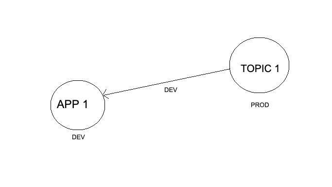
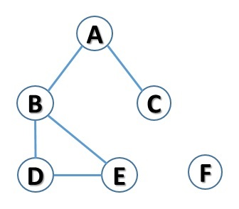
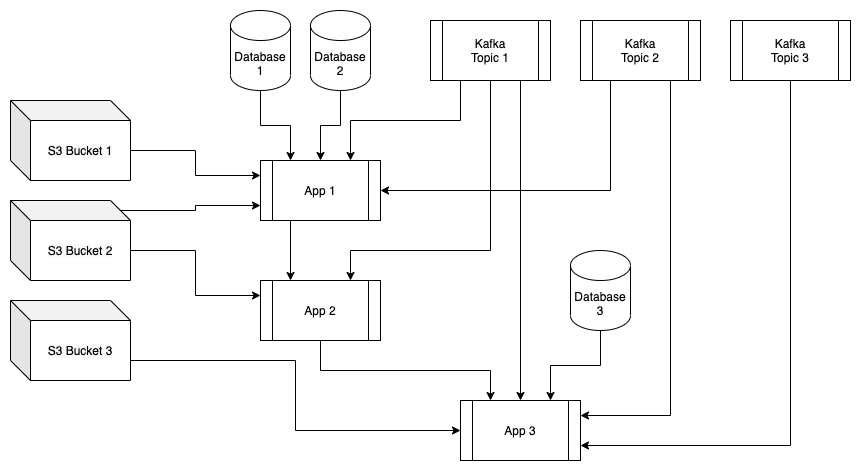
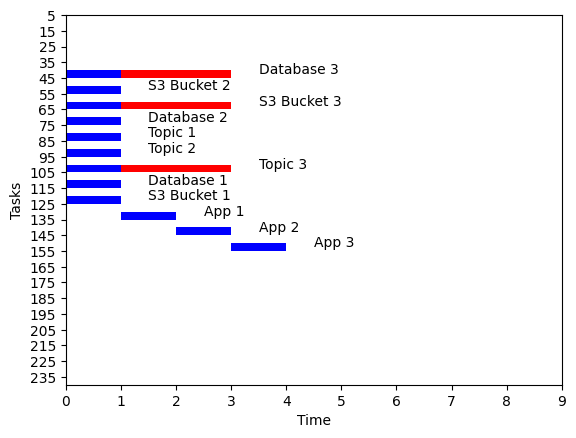
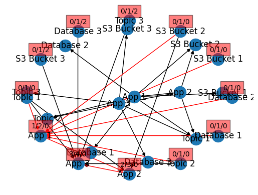
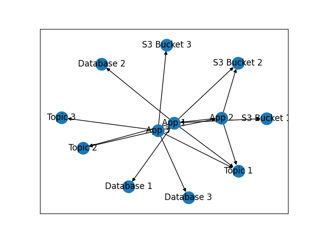

# Mudra

- [Mudra](#mudra)
  - [Development \& Execution](#development--execution)
    - [Environment Setup](#environment-setup)
    - [Pre-Requisites](#pre-requisites)
    - [Metrics Setup](#metrics-setup)
    - [Execution](#execution)
    - [Orchestration Tool Arguments](#orchestration-tool-arguments)
      - [Subcommands](#subcommands)
    - [Node Interfaces](#node-interfaces)
      - [Node Interface Commands](#node-interface-commands)
      - [Node Interface Subcommands](#node-interface-subcommands)
      - [Reserved Node Interface Commands](#reserved-node-interface-commands)
  - [Manifest File Format](#manifest-file-format)
  - [Dependency graph](#dependency-graph)
    - [Dependencies problems](#dependencies-problems)
      - [Example 1](#example-1)
      - [Example 2](#example-2)
  - [Test Dependency Model](#test-dependency-model)
    - [Gantt Example](#gantt-example)
    - [Pert Example](#pert-example)
    - [Plot Example](#plot-example)
  - [Resources](#resources)

This utility is purpose-built, multi-threaded and intelligent tool that uses Directed Acyclic Graphing for the orchestration of complex and dependent automation tasks via a condept of nodes, originally to perform multi-phased production migration of Kubernetes based applications (many micro-serviecs resulting in many services and containers) and associated databases from one cloud-provider (AWS) to the other (GCP), while keeping production live and which facilitates the following core requirements:

- Consume service manifest files
- Dependency resolution for service migration
- Determine order of operations for service migration
- Follow instructions in manifest files to perform individual service migration
- Generate diagram of service dependencies
- Track state of overall migration and constituent parts
- Log everything to a file and stdout/stderr

## Development & Execution

### Environment Setup

- All global credentials, per environment (such as usernames, passwords, credentials, etc.) are stored under `{data_files}/environments/{environment_name}.creds`.
- All global environment variables, per environment (such as connection strings, FQDN's, etc.) are stored under `{data_files}/environments/{environment_name}.meta`.
- All node-specific credentials, per environment (such as usernames, passwords, credentials, etc.) are stored under `{data_files}/environments/{environment_name}/nodes/{node_name}.creds`.
- All node-specific environment variables, per environment (such as connection strings, FQDN's, etc.) are stored under `{data_files}/environments/{environment_name}/nodes/{node_name}.meta`.

### Pre-Requisites

1. Setup orchestration tool OS with one of the following options:
   - Setup `Ubuntu 20.04` in a VM (This is required for deployment)
     1. Install Docker and other pre-requisites by executing `$ env-setup/vm-env-setup.sh`
   - Setup MacOS or other development environments
     - Install Python `3.8`
     - Install Docker (if desired)
     - Install `pip`
     - Install `pipenv`
       - MacOS: `$ brew install pipenv`
       - Documentation: <https://pipenv.pypa.io/en/latest/>
2. Install/update Mudra by executing `$ ./update.sh`

### Metrics Setup

Choose one of the following options:

1. Setup `Prometheus push gateway` by executing `$ env-setup/metrics-setup.sh`
2. (Optional) setup both `Prometheus push gateway` and `Prometheus` by executing `$ env-setup/metrics-setup.sh -p`
   1. This is required if you do not have Prometheus running elsewhere, useful for development environments

### Execution

1. `$ ./orchestrate.sh {args}`
   - Replace `{args}` above with any [Orchestration Tool Arguments](#orchestration-tool-arguments)
   - Get help by executing `$ ./orchestrate.sh -- --help`

### Orchestration Tool Arguments

Get help by executing `$ ./orchestrate.sh -- --help`

- `--phase`
  - The phase # that you want to explicitly execute, by default it will execute through all discovered phases from the manifests
- `--environment`
  - The environment that you want to execute against, default `local`
- `--datafiles`
  - Relative path to `data_files` location, this is where environment information and manifests are stored
- `--node`
  - Used to target a specific node and if specified, excution will be limited to this specific node
- `--nodefilter`
  - Processes multiple nodes, based on filter text
- `--action`
  - Used to target a specific action and if specified, excution will be limited to this specific action
- `--extravars`
  - Extra environment variables you want to pass in at runtime, gets merged into Global Environment Variables
- `--preflight`
  - This is a preflight check and executes the `preflight` action of the node interfaces
- `--dryrun`
  - This is a dryrun and passes in `DRYRUN=True` to the node interfaces, used for testing, debugging and development
- `--drawcharts`
  - This will draw the dependency charts for the nodes
- `--chartsonly`
  - This will parse the node files, generate the graph and then the chart files, forces `preflight=True` and does not execute nodes
- `--force`
  - Used to exclude nodes with dependencies or isolated problems of the dependency graph, default is `False`
- `--inspect`
  - Returns all dependencies or isolated problems of the dependency graph in the available environments
- `--loglevel`
  - Set the log level, default is `INFO`
- `--gettree`
  - Walks the dependency tree and returns specific values from the nodes, takes a comma separated list of values
- `--nodetype`
  - Used to target a specific node type and if specified, excution will be limited to this specific node type
- `--maxworkers`
  - Number of workers for parallel execution, default is `1` (serial execution)
- `--logprojectname`
  - Used to specify the name of the log project in Google Cloud Logging
- `--threadlogpath`
  - Used to specify the path to the threaded log files
- `--restart`
  - Used to restart the node execution tracking
- `--skipnodes`
  - Used to skip the execution of specific nodes (comma-separated list)

#### Subcommands

`python plot_threads.py --file='log_file.csv' --imagename='image_name.png'`

Plot the threadings in a parallel execution, the image contains vertical `purple lines` or `crimson points`, each line represents the timestamp difference between the initial and final time, across the lines are number that represent the threading number, at the back of the image are described the threading numbers, with their action and services executed.

### Node Interfaces

Each type of node type has its own interface defined (i.e. S3). The node interface file is a command-line interface which is executed by the orchestration tool, sub-commands are passed as parameters.

Each node interface (script) must read all of its environment specific variables (such as connection strings, FQDN's, credentials, etc.) from environment variables and not expect them to be passed in by mudra.

#### Node Interface Commands

Each node interface is be comprised of a subset of functions, which each represent a command passed as a parameter to the node interface, by the orchestration tool (i.e. start, stop, check).

You can execute each node interface out of band (direct execution of the script).

```bash
$ node_interfaces/S3.py start "{\"name\": \"Bucket 1\"}"
$ node_interfaces/S3.py start "{\"name\": \"Bucket 2\"}"
$ node_interfaces/S3.py start "{\"name\": \"Bucket 3\"}"
$ node_interfaces/Kafka.py start "{\"name\": \"Topic 1\"}"
```

#### Node Interface Subcommands
[Node interface subcommands README.md](node_interfaces/doc/README.md)

#### Reserved Node Interface Commands

The orchestration tool has the following reserved node interface commands:

- start
- stop
- check

## Manifest File Format

The orchestration tooling uses the information described in these manifests to build a dependency graph between all services and their resources and ensures that all dependencies are present/available/up-to-date before proceeding with migrating services.

The main purpose of the manifest is to capture and describe all the dependencies that the servce has:

- Kafka topics that the service reads from go in the dependencies -> Kafka section
- Kafka topics that the service writes to go in the `produces` section (this creates a 'virtual dependency' in the dependency tree)
- Other services that the service depends on go in the dependencies -> App section
List the names of other services (from other service manifests) that this service depends on. The names should be pretty close to the actual service names (e.g. edge-fnv2-service), but more accurately the services listed here should map to the "Name" attribute in the other services' manifests.
- S3 buckets that the service depends on are listed in dependencies -> S3 section
`Note`: because S3 buckets are named differently between different environments (e.g. dev, staging, etc), the value that goes into this section should be a unique key for the bucket, which will then be used in the s3 data migration configuration for this bucket. If you're not sure what to name the bucket, just use something along the lines of 'service-name-bucket-name' - e.g. "edge-fnv2-service-bucket1" . It would be the responsibility of the Orchestration team to make sure that the bucket names listed here match the bucket names configured in the S3 data migration configuration.
- Relational databases that the service depends are listed in dependencies -> Database section
`Note` :  Similarly to the s3 buckets, database names will vary between environments (dev/staging/etc). As a result, the value that is added here would be a unique name/key for the database. Because the services often have only a single database that they interact with, it is often sufficient to use the service name, e.g. if the "edge-fnv2-service" had a databse, just add "edge-fnv2-service" in the list of databases. It will be the responsibility of the orchestration team to reconcile the database names used here with the database migration configuration.

The `meta` section of the manifest provides additional detail for how the tool interacts with the various parts of the Orchestration tool chain. Values defined in this section are passed as environment variables into the various scripts that the orchestration tool executes. Of notable importance are the `K8S_SOURCE_NAMESPACE` and `K8S_TARGET_NAMESPACE` values as they specify the namespace in which the service is running in the source (e.g. AWS) k8s cluster and the "target" (e.g. GCP) k8s cluster.

The `actions` section of the manifest is of primary interest to the Orchestration team and can generally be ignored by Au service teams, as it allows the tool to organize and execute the actions in different phases of the migration.

```yaml
name: "App 2"
dependencies:
  Kafka:
    - "Topic 1"
  App:
    - "App 1"
  S3:
    - "S3 Bucket 2"
produces:
  - "Topic 4"
type: "App"
meta:
  K8S_SOURCE_NAMESPACE: "default"
  K8S_TARGET_NAMESPACE: "default"
  K8S_SERVICE_NAME: "nginx-1"
  K8S_STATEFULSET_NAME: "nginx-1-nginx"
  SERVICE_TYPE: "StatefulSet"
  K8S_SOURCE_CONTEXT: "gke_us-central1-c_orchestration-sandbox-cluster-1"
  K8S_TARGET_CONTEXT: "gke_us-central1-c_orchestration-sandbox-cluster-2"
  DNS_NAME: "app2.{{ env }}.example.com"
  APP_AFFINITY: "Concurrent"
actions:
  check:
    phases: [1,2,3]
  migrate:
    phases: [1]
  start:
    phases: [2]
  stop:
    phases: [3]
```

## Dependency graph

By definition, a graph `G = (V, E)` where `V` are the vertices and `E` the edges.

Consider that every `manifest file` is a `node` in the space represented by the `name` on the top of the file and it's dependencies are the `edges`.

In this exercise, we consider the following attributes of the nodes:

- `name`: Name on the top of the manifest file
- `environments`: Take the explicited values included in the manifest, if aren't included assume that all envs are available.
- `dependencies`: Contains the dependencies of the node (i.e connections) and include the environments when every dependency is required. Consider the sub-attr `dependencies.environment`

The `dependencies` of the nodes creates the set of `edges E` in a specific environment `e`, when every edge is represented by:

Iterating over every node.dependendies, we create the set of `edges E` in a specific environment `e`, when every edge is represented by:

```Python
For x in node.dependencies:
    edge = (node.name, x, conflicts= conflicts(node.name, x))
```

Where:

- `node.name` is the name of the node
- `x` is the x-dependency of the node with `env == x.dependencies.environments`
- `conflicts(node.name, x)` return True if the node and it's dependency don't share the same `environment`, else return False.

### Dependencies problems

The dependencies problems are the following:

- `Dependencies conflict`: When any `edge` in E: `edge.conflict=="True"`

#### Example 1



Generated by:

```yaml
name: "App 1"
dependencies:
  Kafka:
    - name: "Topic 1"
      environments:
        - dev
type: "App"
environments:
  - dev
  - sandbox
```

```yaml
name: "Topic 1"
type: "Kafka"
environments:
  - prod
```

- `Isolated problem`: When any `node` in V: `degree(node)==0`

#### Example 2



## Test Dependency Model



### Gantt Example



### Pert Example



### Plot Example



## Resources

- <https://kubernetes.io/docs/tasks/access-application-cluster/configure-access-multiple-clusters/>
- <https://kubernetes.io/docs/reference/kubectl/cheatsheet/>
- <https://cloud.google.com/sdk/docs/quickstart>
- <https://cloud.google.com/kubernetes-engine/docs/quickstart>

- <https://www.codegrepper.com/index.php>
